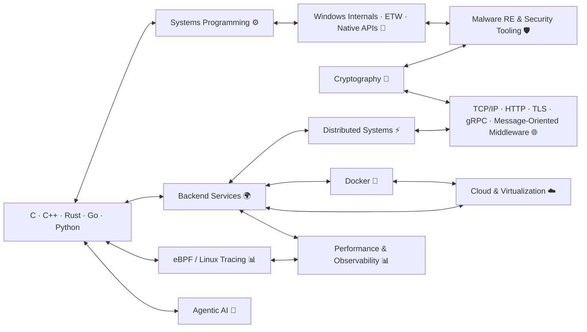

<p align="center">
  
  
  
  
</p>

<p align="center">  
    
    
    
   
    
    
    
    
    
    
    
</p>

---

```id="5n9gde"
manuel@github:~$ whoami
 software engineer  
 
 offensive security researcher
 systems programming enthusiast  
 containers and distributed systems addict
 performance & observability advocate  
 
 5+ years of experience building PoC and production-grade software to solve complex security challenges
```

```id="5n9gde"
manuel@github:~$ philosophy  
"I enjoy jumping into unknown territory: new languages, frameworks, and platforms are just systems to figure out — and eventually understand well enough to see where they break"
```

---
## 🛠️ stack


