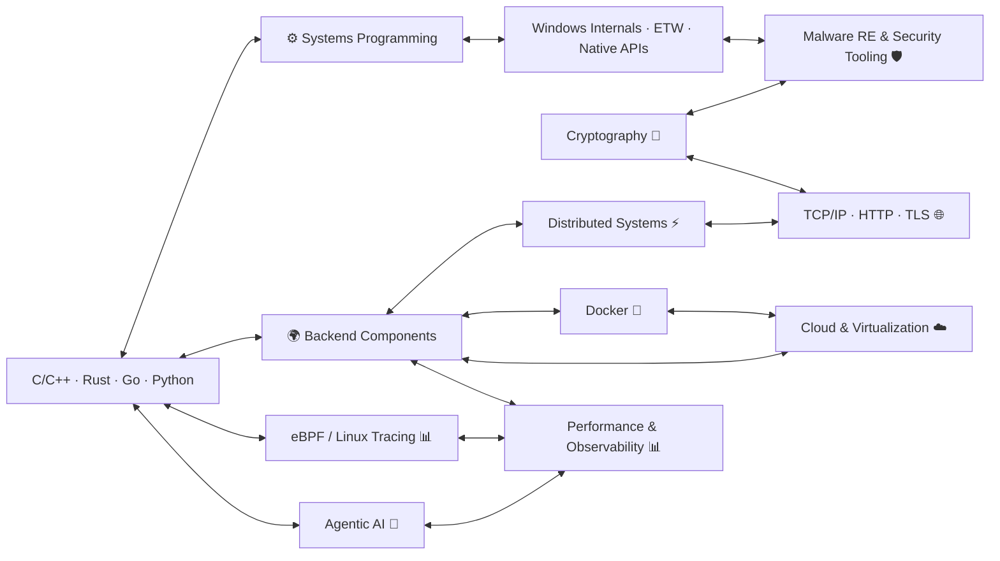

<h1 align="center">
  
</h1>

<p align="center">
  
  
  
  
</p>

<p align="center">
  
  
  
  
  
  
  
</p>

---

```id="5n9gde"
manuel@github:~$ whoami
 security software engineer  
 
 security researcher
 systems programming enthusiast  
 containers and distributed systems addict
 performance & observability advocate  
 
 4+ years working experience building PoC and production software across defense, medical and space domains
```

---

```id="5n9gae"
manuel@github:~$ philosophy  
"I enjoy jumping into unknown territory: if a project needs a new language, framework, or platform, I’m comfortable picking it up quickly and making it work."
```

---

```id="3zv2q8"
manuel@github:~$ built
 ransomware detection via Windows ETW
 C2 infrastructure components, implants, and related artifacts
 security products backed by containerized, distributed microservices
 
Professional work cannot be public so this GitHub mostly contains experiments and university projects
```

---

```id="7jv1qk"
manuel@github:~$ thesis
 ETW ransomware detector

 + real-time OS telemetry monitoring
 + early encryption behaviour detection
 + <1% CPU overhead
 + deployable endpoint prototype

 score: 110/110
 CLUSIT cybersecurity award 🏆
```

---

```id="g0g4fe"
manuel@github:~$ interests
windows internals 🧠
undocumented windows native APIs 🕵️
performance tracing (ETW) 📊
distributed infrastructure 🌍
network protocols 🌐
cryptography 🔐
agentic AI 🤖
```

---
## 🛠️ stack


